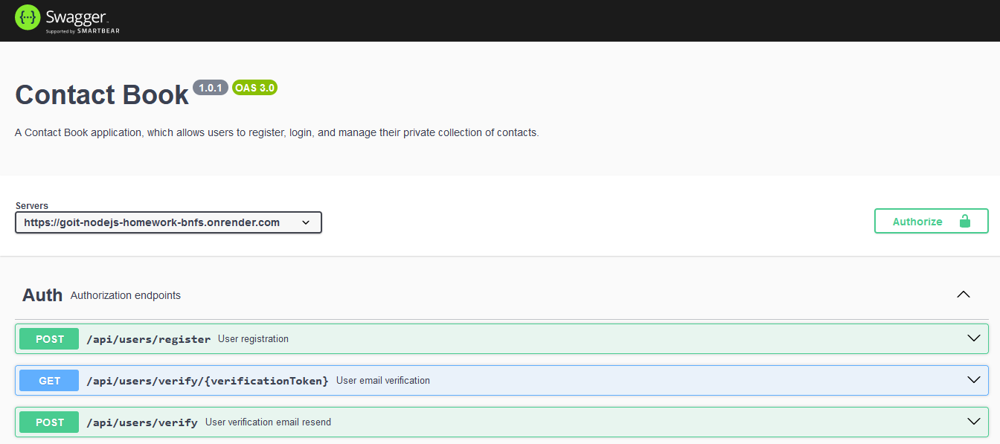

# Contact Book Backend

This project is a Node.js/Express backend application for the [Contact Book](https://contact-book-app-frontend.vercel.app/) web-application.

This project implements user authentication and authorization using JSON Web Tokens (JWT), and user email verification using the SendGrid service, password recovery, and Google authentication.
Users can seamlessly log in with Google, recover forgotten passwords, and manage their contact list by adding, editing, deleting contacts, and marking favorites.

## Table of Contents

- [Swagger Documentation](https://goit-nodejs-homework-bnfs.onrender.com/docs/)
- [Installation](#installation)
- [Usage](#usage)
- [Configuration](#configuration)
- [Technology stack](#technology-stack)
- [Endpoints](#endpoints)
- [Contributing](#contributing)

## Swagger Docs

OpenAPI specification is available at /docs endpoint. It provides detailed information about the available API endpoints, request formats, and response formats.

```javascript
"https://goit-nodejs-homework-bnfs.onrender.com/docs/";
```



## Base URL

The backend part of the web-app is located at render.com web service.

```javascript
BASE_URL = "https://goit-nodejs-homework-bnfs.onrender.com/api";
```

## Installation

To run this project locally, follow these steps:

1.  Clone the repository:

```bash
  git clone  https://github.com/nastiaknik/goit-nodejs-homework.git
```

2.  Install dependencies:

```bash
  npm install
```

3.  Start the development server:

```bash
  npm start
```

This will start the application and you can view it in your browser at http://localhost:3001.

## Usage

Once the application is running, you can access the API endpoints using a tool like Postman or by integrating with a front-end application.

## Configuration

The application uses environment variables for configuration.
Create a .env file in the root directory with the following variables:

```bash
DB_HOST=mongodb://your-mongodb-host:your-mongodb-port/your-database-name
SENDGRID_API_KEY=your-sendgrid-api-key
SECRET_KEY=your-secret-key
FRONTEND_BASE_URL=your-frontend-base-url
BASE_URL=your-backend-base-url
PORT=3001
GOOGLE_ID=your-google-id
GOOGLE_SECRET=your-google-secret-key
```

## Technology stack

- Node.js (runtime environment)
- Express (web framework)
- MongoDB (database)
- TypeScript (static typing)
- Joi (data validation)
- bcrypt.js (password hashing)
- jsonwebtoken (token-based authentication)
- uuid (generating verification tokens)
- sendgrid/mail (sending emails)
- Swagger (documentation)
- Render (deployment)

<code></code>
<code></code>
<code></code>
<code></code>
<code></code>
<code></code>

## Endpoints

The API provides the following endpoints:

### Authentication endpoints

    POST /api/users/register: Register a new user.
    POST /api/users/login: Login with an existing user.
    GET /api/users/verify/:verificationToken: Verify user email.
    POST /api/users/verify: Resend verification email.
    GET /api/users/current: Get current user details.
    POST /api/users/logout: Logout the current user.
    POST /api/users/recovery: Initiate password recovery.
    PATCH /api/users/recovery/:resetToken: Change password.
    POST /api/users/google: Authenticate with Google.

### Contact endpoints

    GET /api/contacts: Get all contacts for the current user.
    POST /api/contacts: Add a new contact.
    PUT /api/contacts/:id: Update a contact.
    DELETE /api/contacts/:id: Delete a contact.
    PATCH /api/contacts/:id/favorite: Update contact favorite status.

For detailed request and response formats, refer to the [Swagger documentation](https://goit-nodejs-homework-bnfs.onrender.com/docs/)

## Contributing

Contributions are welcome! If you have any suggestions, bug reports, or feature requests, please open an issue or create a pull request.
